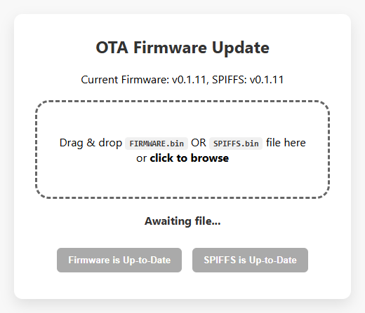
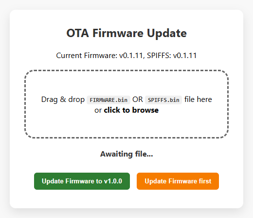
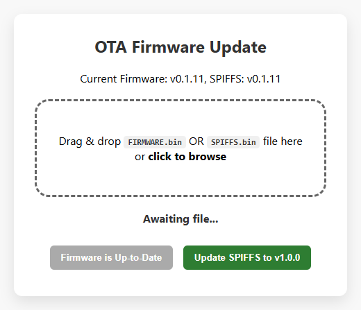

# ESP32 OTA Update Template

A reusable Over-The-Air (OTA) firmware update system for ESP32 projects using PlatformIO and GitHub Actions.

## Features

- Web-based OTA update page with drag & drop support
- Separate firmware and SPIFFS updates
- Independent version tracking (firmware version in code, SPIFFS version in filesystem)
- One-click updates from GitHub releases
- Automatic version checking with update buttons
- GitHub Actions workflow for automated builds and releases

## Screenshots

| Up-to-Date | Update Available |
|------------|------------------|
|  |  |

| SPIFFS Update Only |
|--------------------|
|  |

## Quick Start

### 1. Copy Files to Your Project

Copy the following files/folders to your project:

```
.github/
  workflows/
    build-release.yml       # GitHub Actions workflow

data/
  index_firmware_update.html
  script_firmware_update.js
  style_firmware_update.css
  ota_config.js
  version.txt               # SPIFFS version (updated by workflow)

src/
  ota_updater.h
  ota_updater.cpp
  version.h                 # Firmware version (updated by workflow)
```

### 2. Configure Your Repository

Edit `data/ota_config.js` with your GitHub repository URL:

```javascript
const OTA_CONFIG = {
    GITHUB_BASE_URL: "https://raw.githubusercontent.com/YOUR_ORG/YOUR_REPO/firmware_prod",
    VERSION_JSON: "/version.json",
    FIRMWARE_BIN: "/build/firmware.bin",
    SPIFFS_BIN: "/build/spiffs.bin"
};
```

### 3. Update Your main.cpp

Add the required includes and endpoints:

```cpp
#include "ota_updater.h"
#include "version.h"

// Function to read SPIFFS version from file
String getSpiffsVersion() {
  File file = SPIFFS.open("/version.txt", "r");
  if (!file) return "0.0";
  String version = file.readStringUntil('\n');
  file.close();
  version.trim();
  return version;
}

// Endpoint to return current versions (required for OTA page)
void handleGetConfig(AsyncWebServerRequest *request) {
  String jsonResponse = "{\"version_firmware\":\"" + String(VERSION_FIRMWARE) + "\""
                        ",\"version_spiffs\":\"" + getSpiffsVersion() + "\"}";
  request->send(200, "application/json", jsonResponse);
}

void setup() {
  // ... your setup code ...

  // Required endpoints
  server.on("/update_firmware", HTTP_GET, handleFirmwareUpdate);
  server.on("/get_config", HTTP_GET, handleGetConfig);

  // Initialize OTA
  setupOTA(server);
}

void loop() {
  // Handle scheduled reboot after OTA
  if (shouldReboot && millis() >= rebootTime) {
    ESP.restart();
  }

  // ... your loop code ...
}
```

### 4. Set Up GitHub Actions Runner

The workflow uses a self-hosted runner. Set up your runner with:
- PlatformIO CLI installed
- Git configured

Update the PlatformIO path in `.github/workflows/build-release.yml` if needed:
```yaml
& "C:/Python314/Scripts/pio.exe" run -e esp32dev
```

### 5. Create a Release

Push a version tag to trigger a build:

```bash
git tag v1.0.0
git push origin v1.0.0
```

This will:
1. Build firmware and SPIFFS binaries
2. Create a GitHub release with the binaries
3. Update the `firmware_prod` branch with latest builds and version.json

## How It Works

### Version Tracking

- **Firmware version**: Stored in `src/version.h` as `VERSION_FIRMWARE`
- **SPIFFS version**: Stored in `data/version.txt` (read from filesystem)

This separation allows independent version tracking. After a firmware update, the SPIFFS version remains unchanged until SPIFFS is also updated.

### Update Flow

1. User navigates to `/update_firmware`
2. Page fetches current versions from `/get_config`
3. Page fetches available versions from GitHub (`version.json`)
4. Buttons show update status:
   - **Green**: Update available, click to update
   - **Gray**: Already up-to-date
   - **Orange**: Waiting (SPIFFS waits for firmware update)
5. User clicks button to download and install update
6. Device reboots after successful update

### GitHub Workflow

On tag push (v*):
1. Extracts version from tag
2. Updates `src/version.h` with firmware version
3. Builds firmware
4. Updates `data/version.txt` with SPIFFS version
5. Builds SPIFFS
6. Creates GitHub release with versioned binaries
7. Pushes to `firmware_prod` branch:
   - `build/firmware.bin`
   - `build/spiffs.bin`
   - `version.json`

## File Reference

| File | Purpose |
|------|---------|
| `ota_updater.h/cpp` | OTA endpoint handlers |
| `version.h` | Firmware version define |
| `data/version.txt` | SPIFFS version file |
| `data/ota_config.js` | GitHub URL configuration |
| `data/index_firmware_update.html` | OTA web page |
| `data/script_firmware_update.js` | OTA JavaScript logic |
| `data/style_firmware_update.css` | OTA page styling |
| `build-release.yml` | GitHub Actions workflow |

## Dependencies

Add to your `platformio.ini`:

```ini
lib_deps =
    https://github.com/me-no-dev/ESPAsyncWebServer.git
    https://github.com/me-no-dev/AsyncTCP.git
```

## Customization

### Update Page URL

The OTA page is served at `/update_firmware`. To change this, modify the route in your `main.cpp`:

```cpp
server.on("/your_custom_path", HTTP_GET, handleFirmwareUpdate);
```

### Styling

Edit `data/style_firmware_update.css` to match your project's design.

### Additional Config Data

Extend `handleGetConfig()` to return additional device information:

```cpp
void handleGetConfig(AsyncWebServerRequest *request) {
  String jsonResponse = "{\"version_firmware\":\"" + String(VERSION_FIRMWARE) + "\""
                        ",\"version_spiffs\":\"" + getSpiffsVersion() + "\""
                        ",\"device_name\":\"My Device\""
                        ",\"uptime\":" + String(millis() / 1000) + "}";
  request->send(200, "application/json", jsonResponse);
}
```

## Troubleshooting

### Update button shows "check failed"
- Verify GitHub repository URL in `ota_config.js`
- Ensure `firmware_prod` branch exists with `version.json`
- Check browser console for CORS or network errors

### Version not updating after firmware update
- SPIFFS version is stored separately - update SPIFFS too
- Ensure `data/version.txt` exists in your SPIFFS files

### Build fails in GitHub Actions
- Verify PlatformIO path in workflow
- Check that self-hosted runner is online
- Review workflow logs for specific errors
